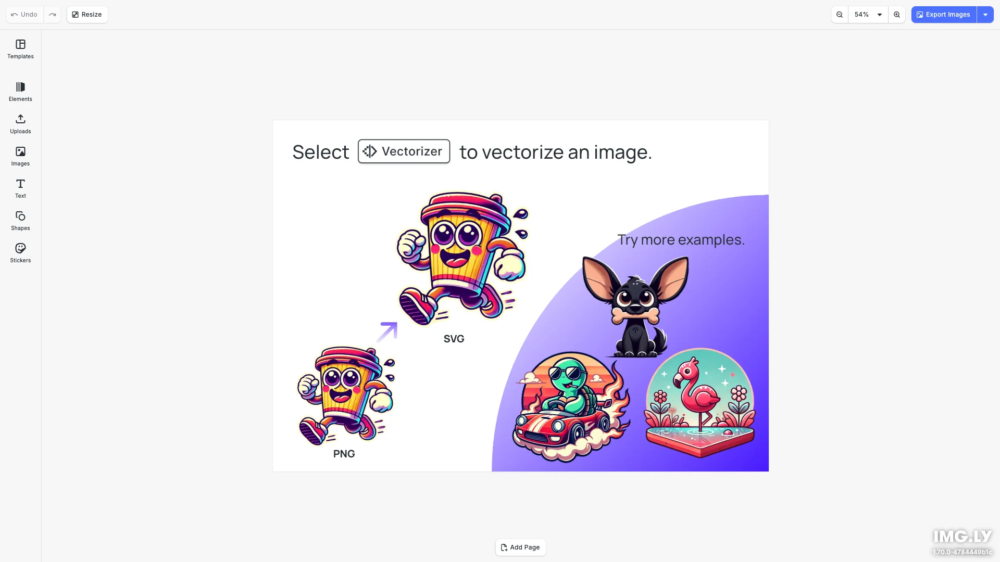

# Vectorizer Editor Starter Kit

Convert raster images to scalable vector graphics. Transform PNG, JPG, and other bitmap images into crisp vectors that scale perfectly at any size. Built with [CE.SDK](https://img.ly/creative-sdk) by [IMG.LY](https://img.ly), runs entirely in the browser with no server dependencies.

<p>
  <a href="https://img.ly/docs/cesdk/js/plugins/vectorizer/">Documentation</a> |
  <a href="https://img.ly/showcases/cesdk">Live Demo</a>
</p>



## Features

- **Image Vectorization** - Convert raster images to vector graphics:
  - **Canvas Menu**: Select an image, click the three-dot menu, and choose "Vectorize"
  - AI-powered conversion produces clean, scalable vector paths
- **Text Editing** - Typography with fonts, styles, and effects
- **Image Placement** - Add, crop, and arrange images
- **Shapes & Graphics** - Vector shapes and design elements
- **Export** - PNG, PDF with quality controls

## Getting Started

### Clone the Repository

```bash
git clone https://github.com/imgly/starterkit-vectorizer-editor-ts-web.git
cd starterkit-vectorizer-editor-ts-web
```

### Install Dependencies

```bash
npm install
```

### Download Assets

CE.SDK requires engine assets (fonts, icons, UI elements) served from your `public/` directory.

```bash
curl -O https://cdn.img.ly/packages/imgly/cesdk-js/$UBQ_VERSION$/imgly-assets.zip
unzip imgly-assets.zip -d public/
rm imgly-assets.zip
```

### Run the Development Server

```bash
npm run dev
```

Open `http://localhost:5173` in your browser.

## Usage

### Via Canvas Menu
1. Select an image on the canvas
2. Click the three-dot menu (canvas menu)
3. Select "Vectorize" from the menu
4. The image will be converted to a vector graphic

## Architecture

```
starterkit-vectorizer-editor-ts-web/
├── src/
│   ├── index.ts              # Application entry point
│   └── imgly/
│       ├── index.ts          # Editor initialization with vectorizer plugin
│       ├── plugins/
│       │   └── vectorizer.ts # Vectorizer plugin setup (canvas menu)
│       └── config/
│           ├── plugin.ts         # Main plugin orchestration
│           ├── actions.ts        # Load, Save, Export actions
│           ├── features.ts       # Feature toggles
│           ├── settings.ts       # Engine behavior
│           ├── i18n.ts           # Internationalization
│           └── ui/               # UI layout configuration
├── public/                       # Static assets (engine assets go here)
├── package.json
└── vite.config.ts
```

**Note:** The demo scene is loaded from the public IMG.LY showcases URL.

## Prerequisites

- **Node.js v20+** with npm - [Download](https://nodejs.org/)
- **Supported browsers** - Chrome 114+, Edge 114+, Firefox 115+, Safari 15.6+

## Troubleshooting

| Issue | Solution |
|-------|----------|
| Editor doesn't load | Verify assets are accessible at `baseURL` |
| Assets don't appear | Check `public/assets/` directory exists |
| Watermark appears | Add your license key |
| Vectorize option missing | Ensure `@imgly/plugin-vectorizer-web` is installed |

## Documentation

For complete integration guides and API reference, visit the [Vectorizer Plugin Documentation](https://img.ly/docs/cesdk/js/plugins/vectorizer/).

## License

This project is licensed under the MIT License - see the [LICENSE](LICENSE) file for details.

---

<p align="center">Built with <a href="https://img.ly/creative-sdk?utm_source=github&utm_medium=project&utm_campaign=starterkit-vectorizer-editor">CE.SDK</a> by <a href="https://img.ly?utm_source=github&utm_medium=project&utm_campaign=starterkit-vectorizer-editor">IMG.LY</a></p>
