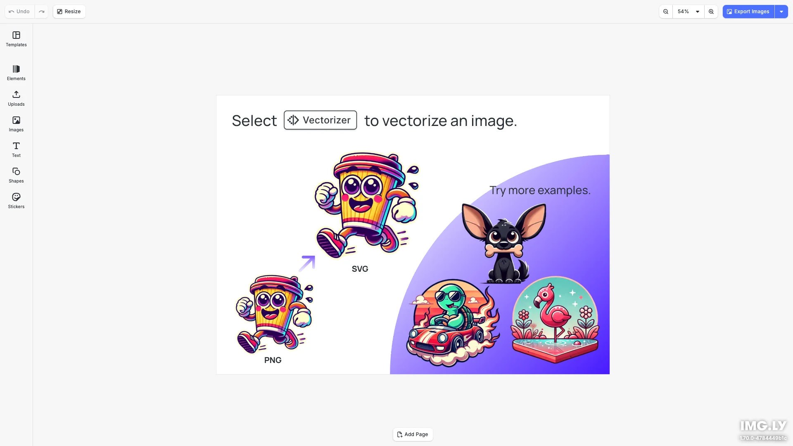

# Vectorizer Editor Starter Kit

Transform your pixel-based images into scalable vector graphics with Vectorizer Plugin. Built with [CE.SDK](https://img.ly/creative-sdk) by [IMG.LY](https://img.ly), runs entirely in the browser with no server dependencies.

<p>
  <a href="https://img.ly/docs/cesdk/js/starterkits/vectorizer-editor-vctre1/">Documentation</a>
</p>



## Features

- **Image Vectorization** - Convert raster images to vector graphics:
  - **Canvas Menu**: Select an image, click the three-dot menu, and choose "Vectorize"
  - AI-powered conversion produces clean, scalable vector paths
- **Text Editing** - Typography with fonts, styles, and effects
- **Image Placement** - Add, crop, and arrange images
- **Shapes & Graphics** - Vector shapes and design elements
- **Export** - PNG, PDF with quality controls

## Getting Started

### Clone the Repository

```bash
git clone https://github.com/imgly/starterkit-vectorizer-editor-ts-web.git
cd starterkit-vectorizer-editor-ts-web
```

### Install Dependencies

```bash
npm install
```

### Download Assets

CE.SDK requires engine assets (fonts, icons, UI elements) served from your `public/` directory.

```bash
curl -O https://cdn.img.ly/packages/imgly/cesdk-js/$UBQ_VERSION$/imgly-assets.zip
unzip imgly-assets.zip -d public/
rm imgly-assets.zip
```

### Run the Development Server

```bash
npm run dev
```

Open `http://localhost:5173` in your browser.

## Usage

### Via Canvas Menu

1. Select an image on the canvas
2. Click the three-dot menu (canvas menu)
3. Select "Vectorize" from the menu
4. The image will be converted to a vector graphic

## Architecture

```
src/
├── imgly/
│   ├── config/
│   │   ├── actions.ts                # Export/import actions
│   │   ├── features.ts               # Feature toggles
│   │   ├── i18n.ts                   # Translations
│   │   ├── plugin.ts                 # Main configuration plugin
│   │   ├── settings.ts               # Engine settings
│   │   └── ui/
│   │       ├── canvas.ts                 # Canvas configuration
│   │       ├── components.ts             # Custom component registration
│   │       ├── dock.ts                   # Dock layout configuration
│   │       ├── index.ts                  # Combines UI customization exports
│   │       ├── inspectorBar.ts           # Inspector bar layout
│   │       ├── navigationBar.ts          # Navigation bar layout
│   │       └── panel.ts                  # Panel configuration
│   ├── index.ts                  # Editor initialization function
│   └── plugins/
│       └── vectorizer.ts
└── index.ts
```

**Note:** The demo scene is loaded from the public IMG.LY showcases URL.

## Prerequisites

- **Node.js v22+** with npm - [Download](https://nodejs.org/)
- **Supported browsers** - Chrome 114+, Edge 114+, Firefox 115+, Safari 15.6+

## Troubleshooting

| Issue                    | Solution                                           |
| ------------------------ | -------------------------------------------------- |
| Editor doesn't load      | Verify assets are accessible at `baseURL`          |
| Assets don't appear      | Check `public/assets/` directory exists            |
| Watermark appears        | Add your license key                               |
| Vectorize option missing | Ensure `@imgly/plugin-vectorizer-web` is installed |

## Documentation

For complete integration guides and API reference, visit the [Vectorizer Plugin Documentation](https://img.ly/docs/cesdk/js/edit-image/vectorize-2b4c7f/).

## Demo Assets

The demo assets for this starter kit load from the IMG.LY CDN by default —
nothing to configure. If you want to own them — edit them, meet compliance
requirements, or remove the CDN dependency for production — eject them
(the archive contains only this kit's files):

```bash
# Download this starter kit's demo assets
curl -O https://staticimgly.com/imgly/cesdk-web-examples-data/1.82.0/starterkit-vectorizer-editor/demo-assets.zip
unzip demo-assets.zip -d demo-assets
rm demo-assets.zip
```

Upload the extracted files to your own server or CDN, then point the app
at them via `.env`:

```bash
VITE_DEMO_ASSETS_BASE_URL=https://cdn.yourdomain.com/demo-assets
```

The default URL is the `DEMO_ASSETS_BASE_URL` constant in `src/index.ts` if you
prefer changing it in code.

The demo assets are intended for development and prototyping — replace
them with your own content or licensed stock assets before shipping to
production (see `DEMO-ASSETS-NOTICE.txt` in the download). This applies in
particular to media such as music tracks and stock imagery.

## License

This project is licensed under the MIT License - see the [LICENSE](LICENSE) file for details.

---

<p align="center">Built with <a href="https://img.ly/creative-sdk?utm_source=github&utm_medium=project&utm_campaign=starterkit-vectorizer-editor">CE.SDK</a> by <a href="https://img.ly?utm_source=github&utm_medium=project&utm_campaign=starterkit-vectorizer-editor">IMG.LY</a></p>
